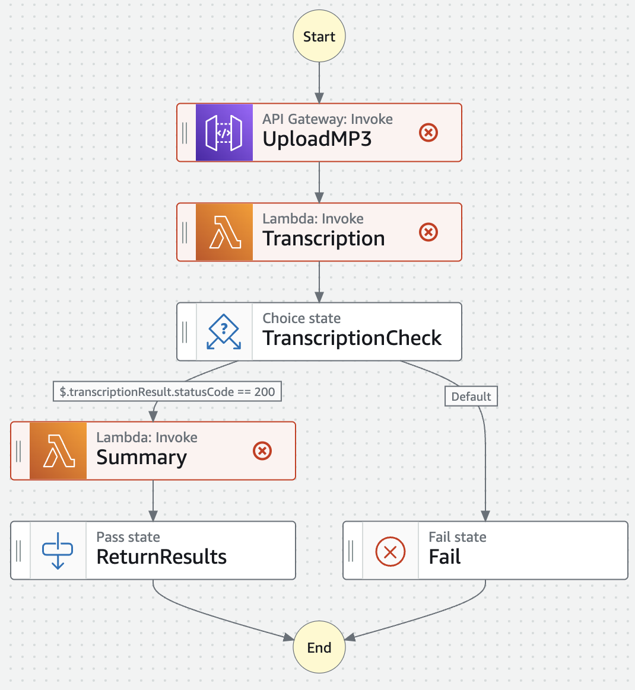

# Transcription and Summarization Service

The goal of this service is to provide a transcription and summarization service for clincal notes. The service will built on top of Assembly AI's transcription service and will be using GPT4 for the transcription of the data. 

## Architecture Diagram

The flow of the application will be as follows:
1. The user will make an api request to the API Gateway
2. The API Gateway will trigger the Transcription Lambda function
3. The Transcription Lambda will make a request to the Assembly AI service to transcribe the audio file
4. The Transcription Lambda will then make a request to the Summarization Lambda function
5. The Summarization Lambda will make a request to the GPT4 service to summarize the transcription
6. The Summarization Lambda will then make a request to the API Gateway to return the summarized transcription to the user

The application will be deployed to AWS using the following services:
- AWS Lambda
- AWS API Gateway
- AWS SAM (Serverless Application Model)